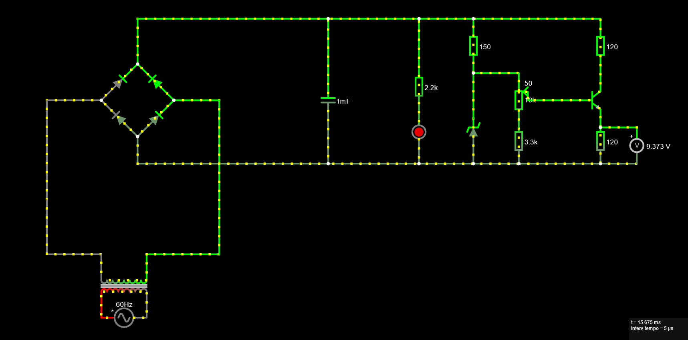
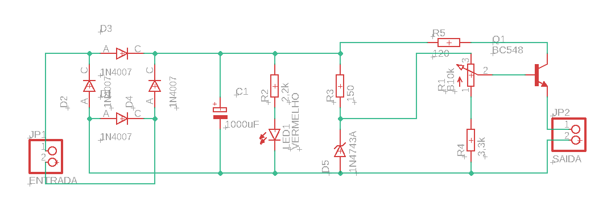
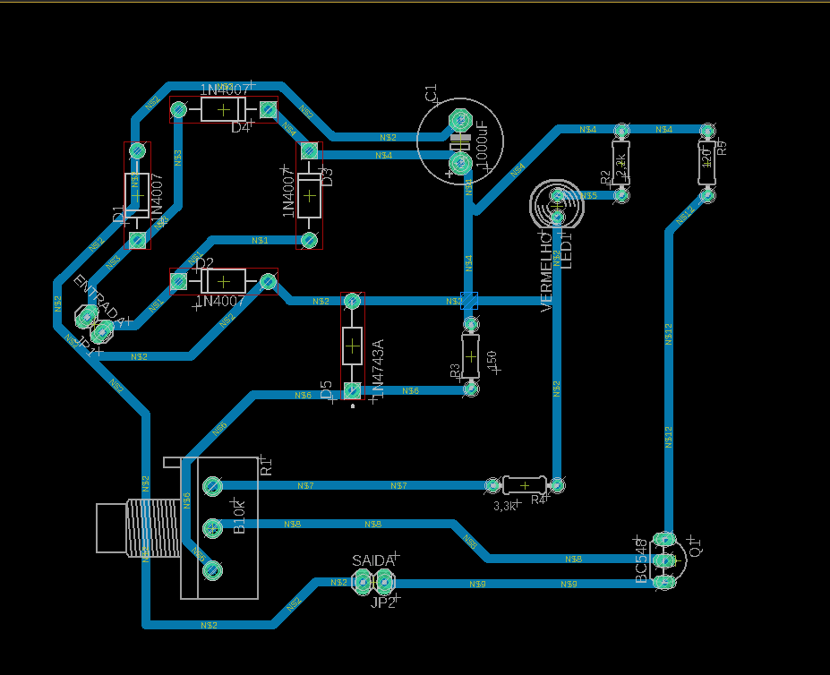
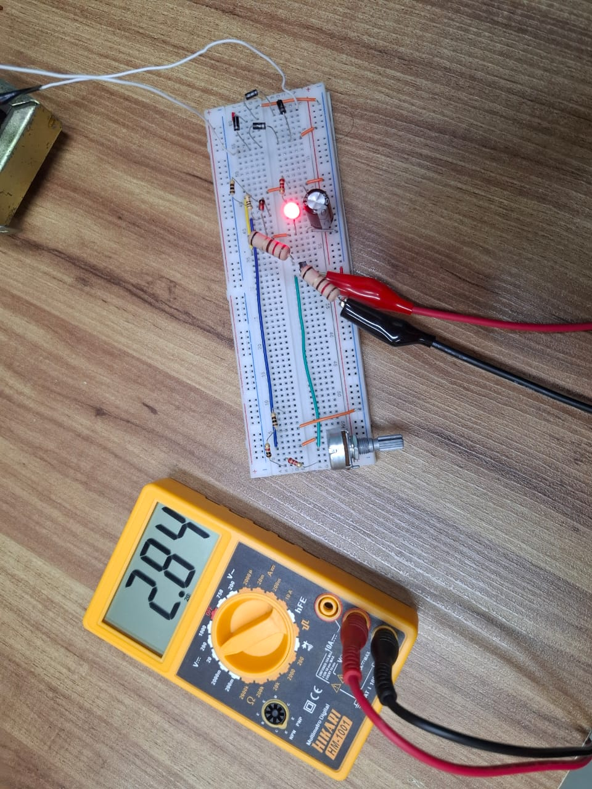
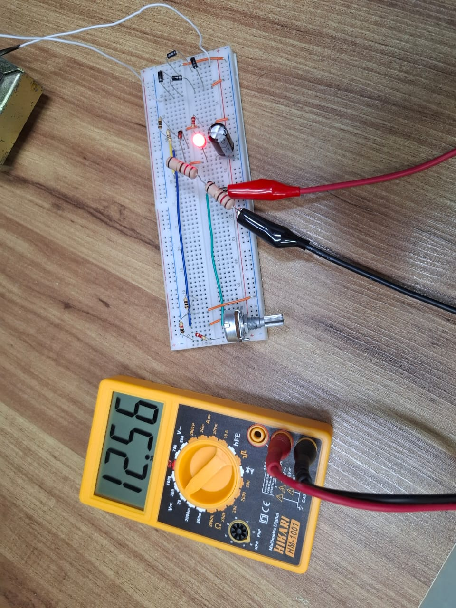

# Fonte de tensão ajustável
## Descrição
Este é o projeto da discilina de eletônica para computação feita por alunos da USP de São Carlos.
A construção em questão é capaz de transformar corrente alternada de 127V em corrente contínua com a tenção ajustavel (3-12V)

## Explicação dos componentes:
* ### Transformador
  Ele é o primeiro lugar que a corrente proveniente da tomada irá passar, esse, é responsável por converter a corrente de 127V em 18V
* ### Ponte de diodos retificadores
  Permite que o cricuito seja alimentado por ambos os sentidos da corrente alternada mas flua em um único sentido
* ### Capacitor
  Dispositivo que, por ser capaz de armazenar carga, é usado para minimizar as oscilações na tensão. O capacitor fornece corrente ao circuito quando a tensão cai e é recarregado pelo transformador quando a tensão aumenta novamente.
* ### Diodo Zener
  O diodo Zener permite que a corrente flua em apenas um sentido quando a tensão atinge um valor específico, que neste projeto é 13V. Ao ser atingida essa tensão, a máxima tensão entre os terminais do diodo se estabiliza, regulando o circuito. Se a tensão for     inferior a 13V, o diodo não conduz e não interfere no circuito. Se a tensão exceder 13V, o diodo permite a passagem da corrente, estabilizando a tensão em 13V
* ### Potenciômetro
  Tem a função de um resistor que pode variar, ele é capaz de controlar qual a potencia da saida (3 a 12V)
* ### Resistores
  Possuem o papel de regular a corrente de acordo com as especificações dos outros componentes
* ### LED
  Apenas um indicador visual para sabermos se a corrente passa ou não

### Lista com os preços
| Componente | Qtd | Total R$ |
| ---------- | --- | -------- |
| Protoboard | 1 | emprestado |
| Capacitor 1000µF | 1 | 2,50 |
| Diodo retificador | 4 | 0,80 |
| Diodo zener 13V | 1 | 0,50 |
| kit Jumpers | 1 | emprestado |
| LED vermelho | 1 | emprestado |
| Potenciômetro 10k | 1 | 7,00 |
| Transistor NPN | 1 | 1,55 |
| Transformador 18V | 1 | emprestado |
| Resistor 100 Ω | 2 | 0,14 |
| Resistor 120Ω 5W | 2 | 3,80 |
| Resistor 1KΩ | 1 | 0,07 |
| Resistor 2.2KΩ | 2 | emprestado |

Total: 16,36
*Os componentes foram comprados na loja Ca And Ma

OBS: O ideal para o projeto seria um resistor de 100Ω e 2W entre o diodo zener e o transistor no lugar do resistor de 120Ω e 2W, porém, não foi achado um componente com essas especificações nas lojas da cidadade. Esse imprevisto gerou duas possibilidades, usar um resistor de 100Ω (pequeno) e por consequencia esquentar muito (solução optada), ou usar o resistor de 120Ω e 5W, o que impossibilitaria obter os 12 Volts esperados por poucas casas decimais.

## Cálculos

## Vídeo explicativo
https://www.youtube.com/watch?v=jUP7bq_nxrs&ab_channel=JonasKaitaUSP

## Simulação no Falstad

https://tinyurl.com/2fyvzy4z

## Esquemático no EAGLE

## PCB no EAGLE

## Foto da Protoboard
 

## Membros do grupo
  * Artur Domitti Camargo - 15441661
  * Joao Pedro Daleffe Dias - 15463342
  * Lucas Mello Ciosaki - 14591305
  * Renan Banci Catarin - 14658181 
